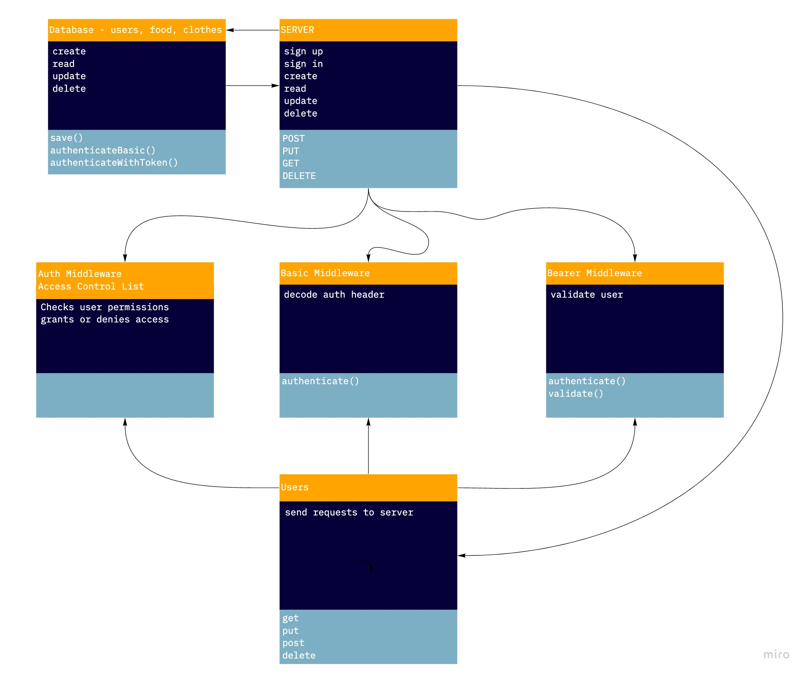

# auth-api

Author: Peter Staker

Deployed URL: [https://auth-api-ps.herokuapp.com/](https://auth-api-ps.herokuapp.com/)

PR: [https://github.com/peterjast/auth-api/pull/1](https://github.com/peterjast/auth-api/pull/1)

* tests [report](https://github.com/peterjast/auth-api/actions)

## Setup

### .env requirements

* PORT - Port Number

* MONGODB_URI - DEV -> mongodb://localhost:27017/auth-api

* SECRET - secret string

### Dependencies

> npm i

### Running the app

> npm start

### Tests

> npm run test

## UML Diagram

